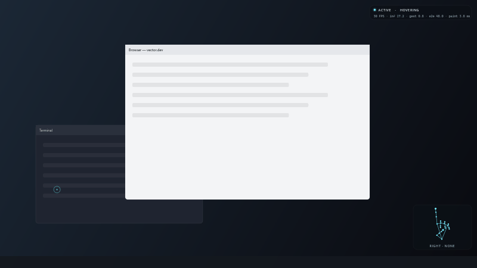
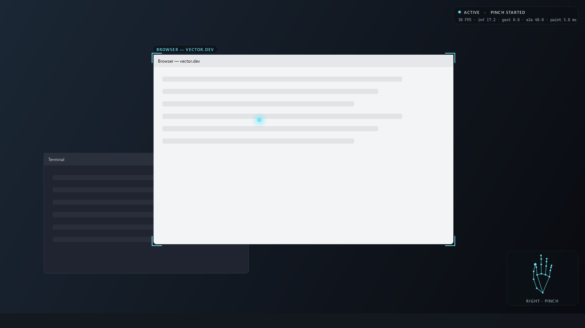
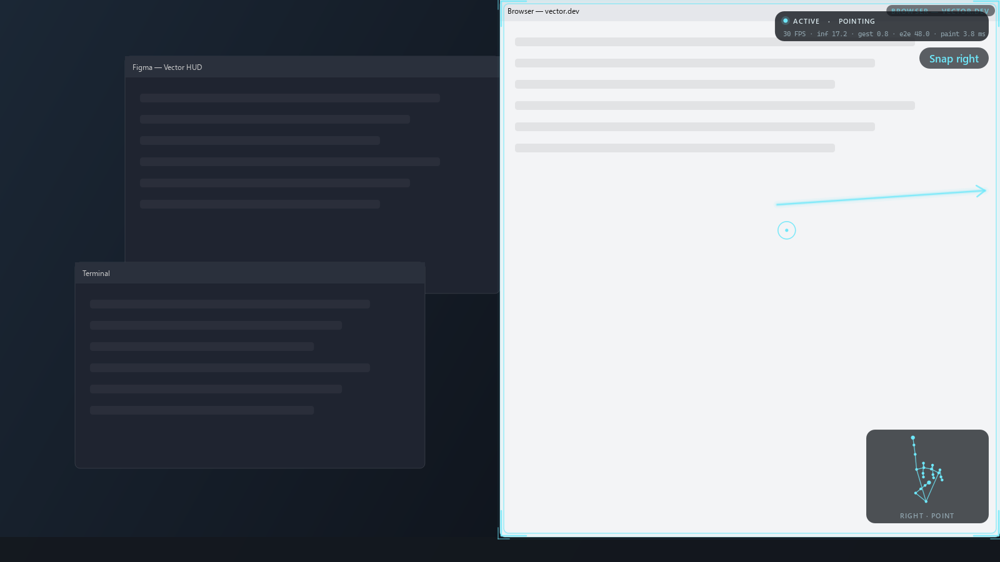
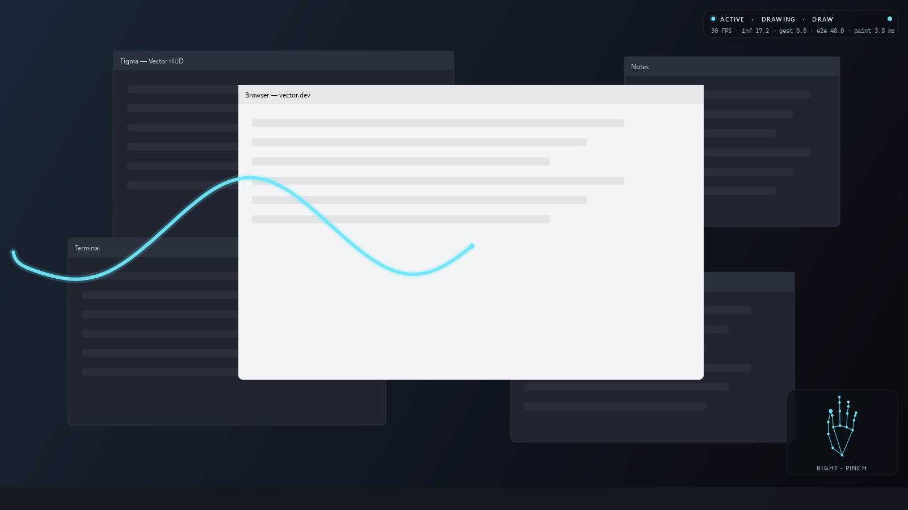
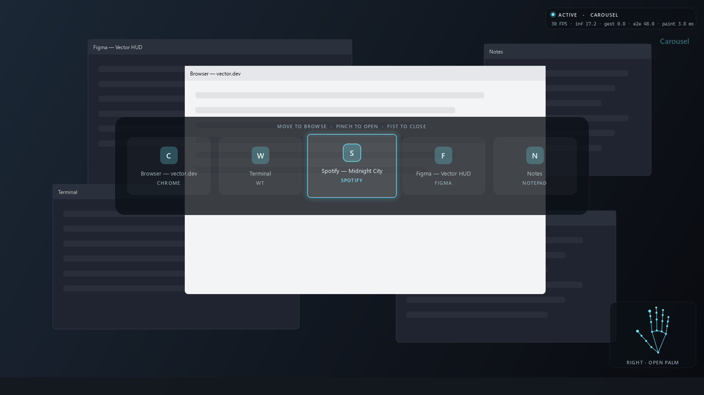
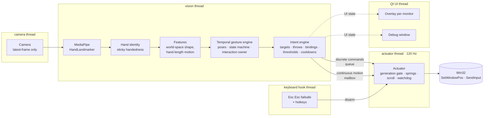
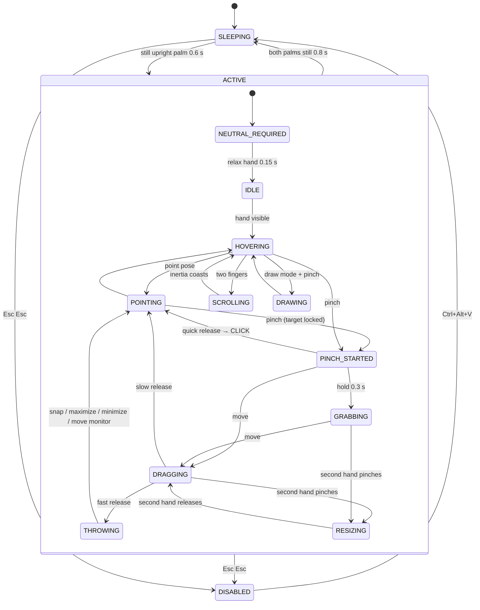

# Vector — a Minority Report UI for your real Windows desktop

**Raise your hand, pinch a window, and throw it onto your other monitor: Vector turns an ordinary webcam into a spatial input device that controls real Windows applications.**



<sub>The animation above is the real HUD painter and the real gesture engine, rendered offscreen from a synthetic hand (`scripts/render_hud_preview.py`). A live screen recording belongs here once one is made; see [Demo](#demo).</sub>

---

## What it does

Vector watches your hands through the webcam and treats them like a trackpad that floats in the air. It moves real windows (not a mock-up UI) through the Win32 API.

| You do | Windows does |
|---|---|
| Point with your index finger | A spatial cursor follows it, and windows light up under it |
| Pinch quickly | Left click (a middle-finger pinch is a right click) |
| Pinch, hold and move | Grabs the window under the cursor and drags it, locked even if the cursor leaves it |
| Release the pinch while moving fast | **Throw:** snap left or right, maximize (up), minimize (down), or jump to the monitor you aimed at |
| Pinch a window with both hands and pull apart | Two-hand resize in width and height, around the midpoint |
| Open palm, swipe sideways | Next / previous application |
| Hold one open palm still, move sideways, pinch | **App carousel**: browse open apps, pinch to switch (a fist closes it) |
| Two fingers, move up or down | Smooth scrolling with inertia |
| Two fingers, flick sideways | Browser back / forward (next / previous track outside browsers) |
| Hold a fist | Play / pause |
| "Shaka" 🤙 and move up or down | Volume |
| Hold three fingers | Draw mode: draw in the air on a transparent overlay |
| Hold an open palm still | Wake up (ACTIVE) |
| Hold both palms still | Go to sleep |
| **Esc Esc** on the keyboard | Emergency stop, instantly |

<p>


</p>
<p>


</p>
<p align="center"></p>

## Demo

```bash
python -m vector --demo
```

Demo mode shows large captions that walk through the showcase sequence. Each caption advances automatically when the real gesture happens, so a screen recording explains itself:

1. Raise hand → **ACTIVE**
2. Point at a browser → it highlights
3. Pinch → lock brackets
4. Drag it
5. Throw it to the second display
6. Grab another window
7. Two-hand stretch
8. Palm swipe → app switch
9. Two fingers → scroll
10. Three fingers → draw mode
11. Draw in the air
12. Fist → clear
13. Both palms → sleep

## Gestures

Every gesture is a **temporal** pattern, never a single frame. The engine tracks hand shape, motion and elapsed time through a state machine, and each gesture has deliberate guards against firing by accident:

| Gesture | Recognised when | Guards against accidents |
|---|---|---|
| Point | Index extended, others curled (continuous pose score) | EMA smoothing + hysteresis + time confirmation |
| Pinch / click | Thumb–index distance ÷ palm length < 0.28 (release > 0.42) | Click only on an *observed* release within 0.28 s; tracking loss cancels; target taken from the cursor 100 ms **before** pinch onset |
| Grab / drag | Pinch held 0.3 s, or palm moves > 0.05 hand-lengths | Window lock persists outside its bounds; drag deltas anchored to the palm |
| Throw | Release while moving > 2.4 hand-lengths/s | Drag must be established, velocity sustained and direction-consistent, minimum displacement; "down" needs 30% more speed |
| Resize | Second hand pinches while a window is held | Both hands acquired atomically; losing either ends safely |
| Swipe | ≥ 0.9 hand-lengths, peak ≥ 2.2 hl/s, horizontal ≥ 1.8× vertical, < 0.6 s | Requires a **pause-then-flick** (≥ 100 ms still first), the pose held crisply for the whole stroke, cooldown, and return-stroke lockout |
| Scroll | Two-finger pose held 0.12 s, vertical motion | Dead zone, vertical dominance, inertia decays |
| Holds | Fist / three fingers still for 0.45 / 0.7 s | Fires once per entry; moving hands never count |
| Carousel | One open palm still for 0.9 s, then sideways travel (0.45 hand-lengths per app) | One hand only (two palms mean sleep); off in draw mode; hysteresis between apps; switches only on pinch |
| Wake | Upright open palm, facing the camera, still, 0.6 s | Needs a *neutral* pose afterwards before any command |
| Sleep | Both palms, still, 0.8 s | Only while nothing is being manipulated |

All thresholds live in the config. Speeds are in **hand-lengths per second**, so they behave the same at 40 cm or 1.5 m from the camera.

## How it works

```
Camera ─▶ Hand tracking ─▶ Landmark features ─▶ Temporal gesture engine ─▶ Intent ─▶ Actuator ─▶ Windows API
 30 fps      MediaPipe        scale-invariant       poses + state machine      context    120 Hz     Win32 / SendInput
                                                             │
                                                             └──────────────▶ HUD overlay (per monitor, 60 Hz)
```

## Architecture



| Module | Responsibility |
|---|---|
| `vision/camera.py` | Threaded capture that always hands out the newest frame, never a queued stale one |
| `vision/tracker.py` | MediaPipe Tasks HandLandmarker, plus persistent hand IDs with handedness *voted* over time |
| `vision/features.py` | Vectorised landmark processing: finger curl, pinch ratio, palm normal, roll, hand scale |
| `gestures/poses.py` | Continuous pose scores → EMA → hysteresis → time-based confirmation; low-latency pinch latch |
| `gestures/engine.py` | The temporal state machine, the global interaction owner, sleep/wake, throws, resize, scroll, draw |
| `gestures/swipe.py` | Stroke-based swipe detection with intent checks |
| `gestures/confidence.py` | Confidence = weighted geometric mean of named factors |
| `cursor/mapper.py` | Hand → desktop mapping: One-Euro filter, hybrid gain curve, drift correction, rope dead zone |
| `intent/` | Target locking, throw interpretation, resize geometry, bindings, thresholds, cooldowns |
| `desktop/` | Monitors and DPI, window control on DWM frame bounds, SendInput, the actuator |
| `overlay/` | HUD painter, air-drawing canvas, debug window |
| `safety.py` | Low-level keyboard hook failsafe |
| `calibration.py`, `recording.py`, `demo.py` | Calibration, dataset recording/replay, demo captions |
| `learned/` | Optional GRU/TCN temporal models and their benchmark |

## Computer vision

**Two coordinate systems, on purpose.** MediaPipe returns each landmark twice: in image space and in a metric, hand-centred *world* space.

- **Shape comes from world space.** This covers finger curl (bend angles along each joint chain), pinch distance (thumb–index distance divided by palm length) and palm orientation. These don't change with distance from the camera.
- **Position and motion come from image space**, with x scaled by the aspect ratio so distances are isotropic. Velocities are divided by a foreshortening-robust hand scale: pixels-per-metre is taken from the *least*-foreshortened palm segment. The result is in hand-lengths per second, so a swipe threshold means the same thing near or far.

**The frame is mirrored before inference.** MediaPipe's handedness labels then match the user's real hands, and moving your hand right moves the cursor right.

**Handedness is a vote, not a fact.** Per-frame labels flicker on ambiguous poses. Tracks are associated by proximity and accumulate a belief about which hand they are. Two simultaneous "Right" hands are resolved by certainty, then by position.

**Temporal recognition, not per-frame classification.** Per-frame pose scores are only *evidence*. A pose is entered only after it has dominated (with a margin) for a minimum *time*, and it is held until its score falls below a lower exit threshold. Gestures are defined over state transitions and motion history: a throw is "established drag → sustained, consistent velocity → observed release". A swipe is "still → crisp pose → fast horizontal stroke".

**The cursor feels like a trackpad, not a webcam demo:**

1. A **One-Euro filter** gives heavy smoothing at rest and light smoothing in motion.
2. A **hybrid gain curve** (0.55× slow → 1.5× fast) makes fine targeting precise and big moves cheap.
3. **Drift correction** toward the absolute mapping runs only while moving and never while engaged, so the cursor can't creep on its own.
4. A **rope dead zone** means the output trails the target by at most 3 px, killing shimmer without the sticky-then-jump feel.
5. A **critically damped spring** in the 120 Hz actuator interpolates between 30 Hz camera frames with zero overshoot.

**Click stabilisation.** Closing a pinch drags the index tip toward the thumb, so the cursor dips just as you click. Vector locks the target using the cursor position from 100 ms *before* the pinch began. While pinched, the pointer becomes *fingertip-at-onset + palm motion since*, which is continuous with the pre-pinch cursor and immune to finger articulation.

## Gesture state machine



Only **one interaction owns the hands at a time**. While you drag a window, the other hand can't fire a swipe, a hold or sleep. Losing tracking cancels an interaction: a hand that leaves the frame mid-pinch never clicks or throws.

## Safety

- **Esc Esc** runs inside a low-level keyboard hook on its own thread. It disarms the actuator immediately, without waiting on the vision or UI threads. The hook ignores synthetic keystrokes, so gestures can never trigger or suppress it.
- Every command carries an **activation generation**, a capture timestamp and an expiry. The actuator is the only component that touches the OS. It refuses commands from a previous generation (the system was disabled or slept since), and refuses commands too old to still reflect intent.
- A **watchdog** stops motion if vision stalls for more than 0.4 s, and ends drags after 1.5 s.
- **Protected windows**: the shell, taskbar, lock screen, Start/search hosts and Vector's own HUD can't be targeted. Hit-testing *stops* at a protected occluder instead of reaching through it to the app underneath.
- No destructive actions exist. Key-chord bindings come only from your own config, and unknown actions are rejected.
- The HUD always shows **ACTIVE / SLEEPING / DISABLED**.

## Performance

Measured on the development machine: i7-1355U laptop, Iris Xe, integrated webcam, Windows 11, 1920×1080 at 125% scaling.

| Stage | Measured |
|---|---|
| Camera | 30 fps (hardware cap; MSMF 640×480. DSHOW at 720p only gave 10 fps) |
| Hand inference, hands tracked | **~17 ms** median (2 hands) |
| Hand inference, no hands | ~30 ms median (the palm detector runs every frame until a hand is found) |
| Gesture pipeline (identity + features + engine) | **0.8 ms / frame** (was 6 ms before vectorising) |
| Intent | < 0.1 ms |
| Window hit test (z-order walk) | 1.5 ms median |
| `SetWindowPos` (async) | 0.25 ms median |
| Actuator loop | 113–120 Hz while armed · 20 Hz idle (to leave CPU for inference) |
| HUD paint (per monitor) | ~3–4 ms mean; stroke splines cached (1,000-point spline: 8 ms once, then free) |
| Capture → intent (vision end-to-end) | ~60 ms mean with the HUD running and no hand in view (palm-detector worst case); lower while tracking |
| Accidental commands, adversarial synthetic motion | **1 in 11.5 simulated minutes**; zero clicks, drags, throws or holds (`scripts/false_positive_bench.py`) |

Inference releases the Python GIL (measured: a 240 Hz thread never stalled over 10 ms during inference), so the pipeline uses threads, not processes. The debug view shows per-stage latency live (mean / p95).

## Launch

**Double-click `launch.bat`.** It creates the Python environment and downloads the hand model on the first run, then starts Vector with no console window. Or, from a terminal in the project folder:

```bash
launch.bat --debug
```

`--debug` adds the developer window. Run `launch.bat --demo` for demo captions, or `launch.bat calibrate` to redo calibration.

- **First launch** runs calibration: raise the hand you point with, then point at the four targets and hold still on each.
- **To start controlling:** raise one open palm, facing the camera, and hold it still for about half a second. The HUD pill turns cyan (**ACTIVE**). Relax your hand, then point.
- **To stop:** hold both palms up (sleep), press **Esc Esc** (emergency stop), or press **Ctrl+Alt+Q** (quit).
- The log is written to `%APPDATA%\Vector\vector.log`.

## Installation

Requirements: Windows 10/11, Python 3.11+, a webcam. `launch.bat` does all of this for you; the manual steps are:

```bash
git clone https://github.com/MoallaMelek/Vector-CS.git
cd Vector-CS
python -m venv .venv
.venv\Scripts\activate
pip install -e .[dev]
python scripts/fetch_model.py
python -m vector
```

The first launch runs **calibration**: raise the hand you point with, then point at four targets and hold still. After that, raise an open palm and hold it still to activate.

```bash
python -m vector --debug
```

Other commands:

```bash
python -m vector calibrate            # recalibrate
python -m vector --demo               # captions for recording videos
python -m vector config               # print effective config + its path
python -m vector clips                # list recorded gesture clips
python -m vector replay CLIP.jsonl.gz # run a recording through the engine
python -m pytest                      # 146 tests
```

### Hotkeys

| Keys | Action |
|---|---|
| **Esc Esc** | Emergency stop |
| Ctrl+Alt+V | Re-arm after an emergency stop |
| Ctrl+Alt+D | Toggle debug window |
| Ctrl+Alt+G | Toggle draw mode |
| Ctrl+Alt+Z / C / K | Undo / clear / next colour |
| Ctrl+Alt+[ / ] | Thinner / thicker pen |
| Ctrl+Alt+S | Export drawing (ink PNG + composite over a clean screenshot) |
| Ctrl+Alt+R | Record a gesture clip |
| Ctrl+Alt+Q | Quit |

## Configuration

Settings live in `%APPDATA%\Vector\user_config.json`. Only the values you change are stored; everything else falls back to the typed defaults in [`vector/config.py`](vector/config.py). Unknown keys and invalid values are reported, never silently ignored.

```json
{
  "dominant_hand": "Left",
  "cursor": { "sensitivity": 1.3, "spring_hz": 16 },
  "gesture": { "swipe_min_speed": 2.6, "throw_min_speed": 2.8 },
  "confidence": { "thresholds": { "app_switch": 0.85 } },
  "cooldown": { "swipe_s": 0.9 },
  "activation": { "require_activation": true, "wake_hold_s": 0.8 },
  "bindings": {
    "fist_hold": "media_play_pause",
    "three_finger_swipe_right": "keys:ctrl+tab",
    "palm_swipe_left": "app_previous"
  },
  "overlay": { "accent": "#6EE7F9", "show_skeleton": true },
  "debug": false
}
```

Config sections: `camera`, `tracker`, `cursor` (region, sensitivity, filter, gain curve, dead zone, spring), `gesture` (every threshold), `confidence`, `cooldown`, `activation`, `safety` (failsafe key, blocked window classes/processes), `draw`, `overlay`, `monitors`, `bindings`.

Bindable actions: `app_next`, `app_previous`, `context_back`, `context_forward`, `browser_back`, `browser_forward`, `media_play_pause`, `media_next`, `media_previous`, `volume_up`, `volume_down`, `volume_mute`, `toggle_draw`, `maximize_foreground`, `minimize_foreground`, `none`, or any chord such as `keys:ctrl+shift+t`.

## Custom gestures

1. Open the debug window (`--debug` or Ctrl+Alt+D), type a label (e.g. `palm_swipe_left`, `circle`, `none`), then click **Record** (or press Ctrl+Alt+R). You get a 3 s countdown and a 2 s capture.
2. Each clip stores landmark sequences only (image and world landmarks, timestamps, velocity, palm normal, pinch ratio, finger extension). It **never stores camera images**, and `data/` is git-ignored.
3. Replay any clip through the deterministic engine with `python -m vector replay <clip>`. It doubles as a regression test for tuning.
4. Compare against learned models:

```bash
python scripts/benchmark_learned.py
```

This trains a GRU and a TCN on your clips with **leave-one-session-out** cross-validation, and scores the deterministic engine on the same clips.

**Adoption rule:** a learned model replaces a heuristic gesture only if it wins on held-out sessions. Deep learning is not used for its own sake.

**Current status:** the learning pipeline is built and runs end to end, but no comparison has been made on real recordings yet. See [Roadmap](#roadmap) and [Current status](#current-status). Here is the synthetic smoke run (`--synthetic`, 120 clips, 6 labels, 4 sessions). It only proves the plumbing works, because the synthetic hand matches the engine's assumptions:

| | Deterministic engine | GRU | TCN |
|---|---|---|---|
| Accuracy (leave-one-session-out) | 120/120 | 118/120 | 118/120 |
| Inference | — | 0.27 ms/seq | 0.16 ms/seq |

By the adoption rule, the deterministic engine stays in charge.

## Testing

The test suite has 146 tests and runs in about 20 seconds. It never needs a webcam:

- **Synthetic kinematic hand.** `vector/sim/synthetic_hand.py` produces MediaPipe-layout landmarks for any pose, position, rotation or handedness. Scripted scenarios (`vector/sim/scenario.py`) add noise and dropouts and drive the *full* pipeline: clicks, drags, throws, resize, swipes, scroll inertia, holds, volume, draw mode, sleep/wake.
- **Negative tests.** Everyday motion must produce no commands. Disabled means disabled. The interaction owner is exclusive. Tracking loss mid-drag cancels without a click or throw. The return stroke of a swipe is ignored. A regression test guards the pinch-onset pointer jump.
- **Real Win32 integration.** Tests spawn their own window in another process and verify exact DWM-frame positioning, maximize/minimize/restore, occluder-aware hit testing, and the real actuator dragging and snapping that window.
- **Unit tests**: config loading and validation, filters (One-Euro, regression velocity, spring frame-rate independence), multi-monitor and mixed-DPI coordinates on synthetic layouts (negative origins, dead zones, cross-DPI transfers), throw decisions, resize geometry, intent gating and cooldowns, the actuator's generation/expiry/watchdog, the failsafe callback, calibration fitting, recording round-trips, and canvas splines.

## Current status

**Verified automatically** on this machine: everything in the test suite. That includes real window moves, snaps, maximize/minimize, the hook install and the actuator. The live app also starts, opens the camera, runs the tracker, HUD, debug window and hook together, and shuts down cleanly.

**Needs a human in front of the camera.** These were not exercised with real hands in this build:

- How the thresholds feel with a real hand: pinch enter/exit, swipe speed, throw speed, hold times. Tune them live in the debug window.
- The palm-facing sign convention on real MediaPipe output (used by wake/sleep). The debug panel shows `facing=`, which should read positive with your palm toward the camera.
- Multi-monitor throws and cursor mapping across mixed DPI. The logic is tested on synthetic layouts, but the development machine has one monitor.
- The Esc Esc failsafe with a physical keyboard (the hook logic is tested with crafted key events).
- End-to-end latency while hands are being tracked. The debug window measures it live.

## Roadmap

- [ ] Tune thresholds from recorded real-hand sessions; publish per-gesture accuracy
- [ ] Record the live demo video for this README
- [ ] Benchmark GRU/TCN against the engine on real clips; adopt per gesture only where it wins
- [x] Application carousel (hold palm, move to browse, pinch to pick)
- [ ] DWM live window thumbnails in the carousel (app icons today)
- [ ] Native "smart" drag mode: pinch-drag in page content performs a mouse drag (select text, move files), while pinch on title bars moves windows
- [ ] Per-application binding profiles
- [ ] GPU inference / higher frame-rate cameras

## Technical challenges

- **DPI virtualisation.** A non-DPI-aware process on a 125% display sees 1536×864 instead of 1920×1080, and every rectangle lies. Vector is per-monitor-v2 aware, keeps all math in physical pixels, and maps into each monitor's Qt logical space separately.
- **Invisible window borders.** On Windows 10/11, `GetWindowRect` includes ~7 px invisible resize borders, so "snap to the left half" leaves a gap. All positioning uses DWM extended frame bounds and compensates the insets.
- **Foreground lock.** `SetForegroundWindow` is restricted. The classic Alt-key workaround can open app menus. Vector uses an empty synthetic mouse input, the same technique PowerToys uses.
- **Click dip.** Closing a pinch moves the fingertip. This is solved with rewound target lookup plus a palm-anchored pointer.
- **Waving is a swipe.** A pure velocity/distance detector fired 24 times in 12 simulated minutes of random motion. Requiring a sustained pause before the flick, and a crisp pose throughout the stroke, brought that down to 1.
- **30 fps camera, 120 Hz feel.** Critically damped springs in a separate actuator thread interpolate between camera samples without overshoot.

## Lessons learned

- **Negative tests are the real spec.** "Does the swipe fire?" is easy. "Does aimless motion *not* fire anything?" is where the design effort went, and a randomised false-positive benchmark made it measurable.
- **Scale-invariance buys robustness for free.** Expressing speed in hand-lengths per second and shape in world space removed a whole class of "works at my distance only" bugs.
- **Render the UI offscreen to check your work.** Rendering the real HUD from synthetic input surfaced a stroke-fill bug and a 400 px pointer jump at grab time that the unit tests had missed. That jump now has its own regression test.
- **Profile before optimising.** The gesture pipeline was 6 ms/frame purely from numpy call overhead on 3-element vectors. Batching dropped it to 0.8 ms.

## Development

Built by Claude Code (writer and tester). OpenAI Codex CLI was consulted as a read-only reviewer in fresh, context-less sessions, following [AI_TEAM.md](AI_TEAM.md):

- **Architecture critique.** Most recommendations were adopted, and one disagreement was resolved by the spec.
- **Final code review.** It reported 9 findings, including 2 safety issues: a stale re-arm could undo an emergency stop, and held sleep palms caused a sleep/wake loop. All 9 were fixed, and each has a regression test that fails on the pre-fix code.

Decisions and handoffs are logged in [`.ai/`](.ai/).
